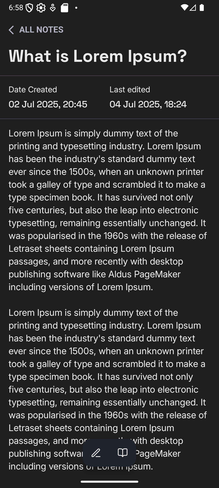
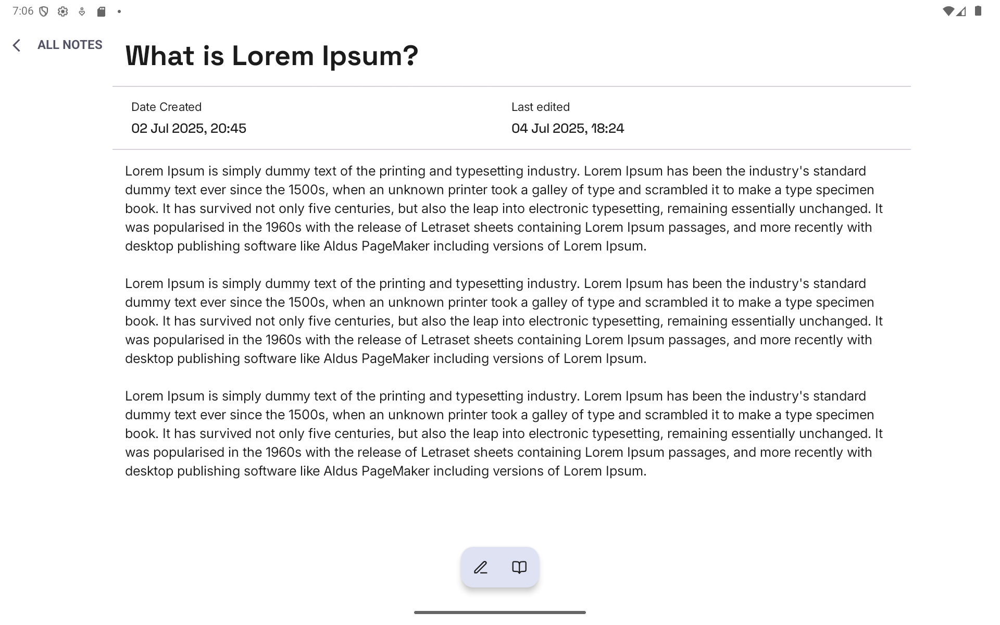
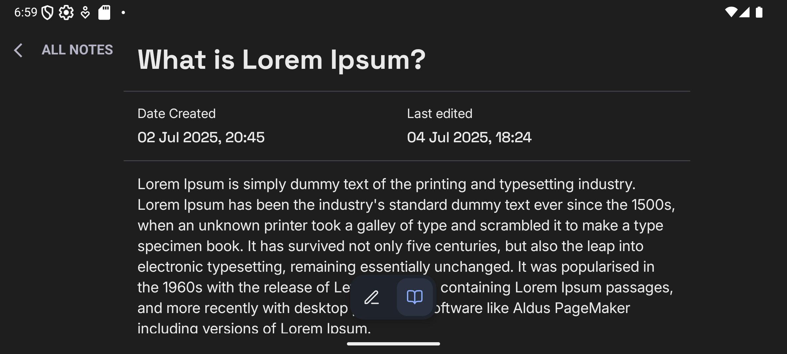
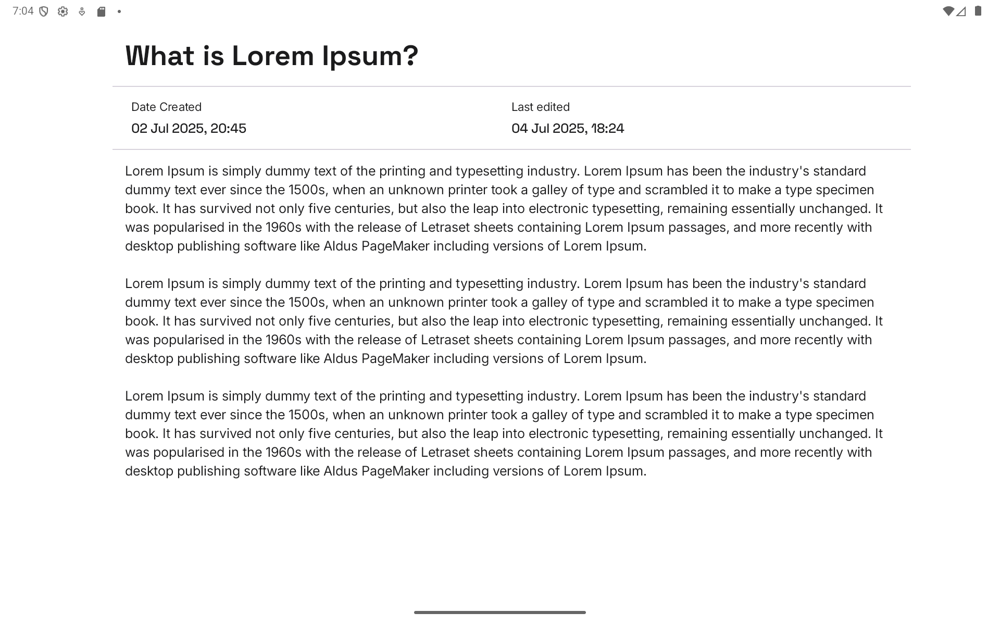
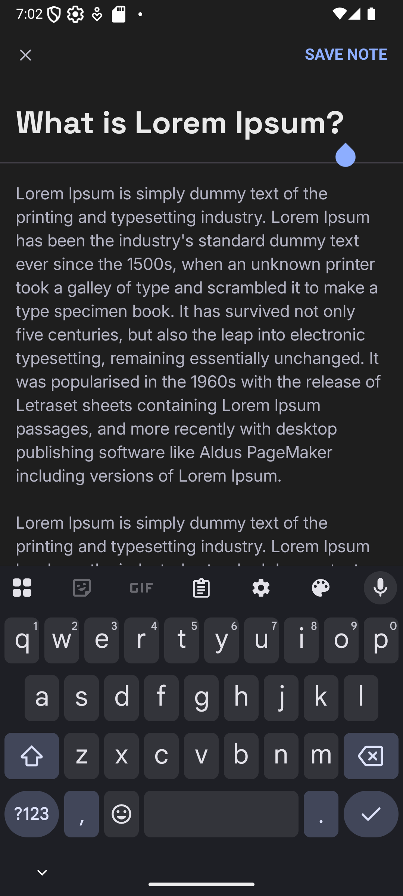
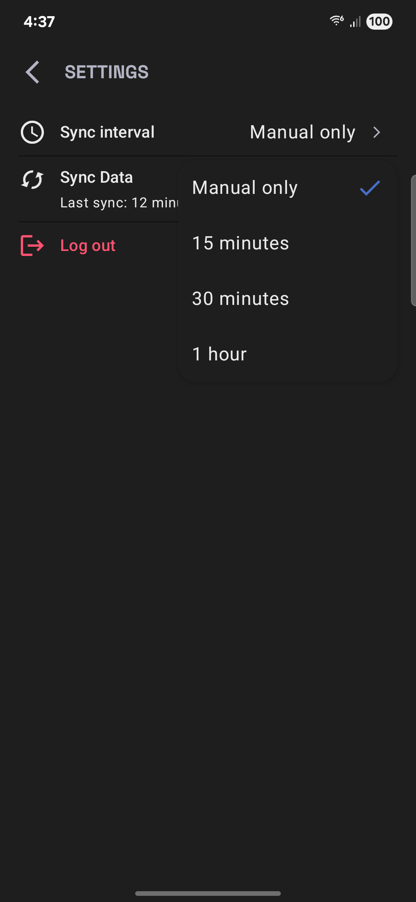
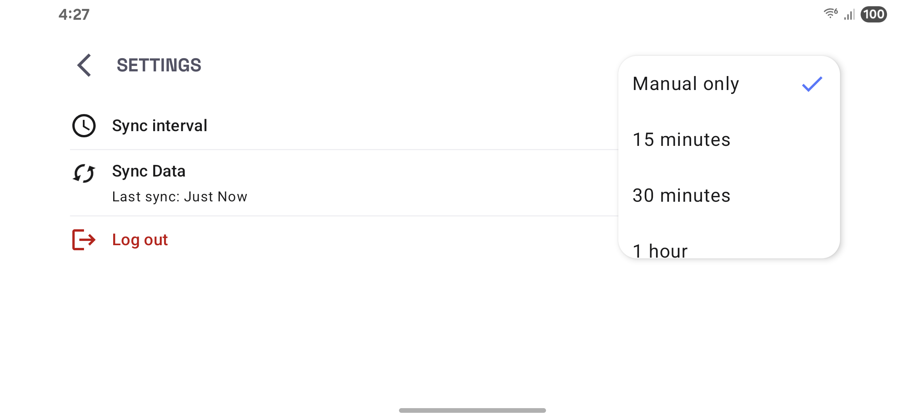
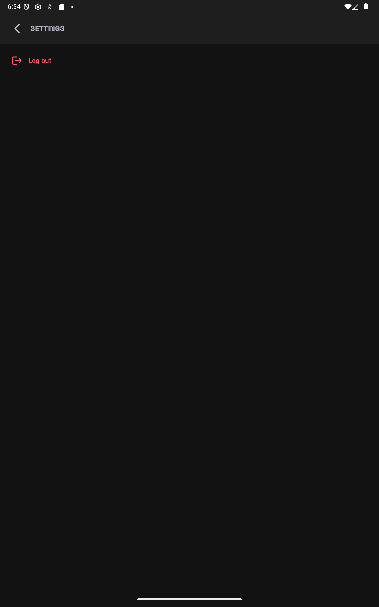
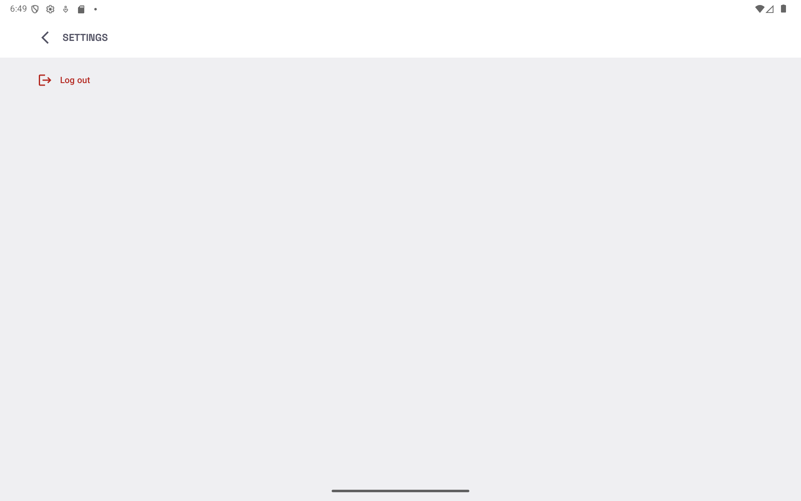

# 📝 NoteMark App

**NoteMark** is an online notes manager app built for the Mobile Dev Campus by [Phillip Lackner](https://pl-coding.com/campus) as part of the monthly challenge. This app is made for fun and to improve skills.

---

## Project Status

This project is divided in 4 different milestones that are launched every fortnight. 
We are currently working in **milestone 3**

### 🚨 Latest Features ###

- **Settings Screen**
  - New button for logging user out
- **Detail Note Screen**
  - Now detail note screen has 3 different modes:
    - View: Just shows the note
    - Read: Shows the note hiding the elements from the UI
    - Edit: Allows to edit the note

---

## 🧑🏽‍💻 Technical implementation

- ✅ Jetpack Compose.
- ✅ MVI architecture (multi-modularized).
- ✅ Compose Navigator.
- ✅ Koin dependency injection.
- ✅ Kor Client for Network calls.
- ✅ Material Design 3 components and theming.
- ✅ Data Store for user preferences (encrypted with security crypto).
- ✅ Room for database

---

## 🎥 Demo ##

https://github.com/user-attachments/assets/ca9d0867-7974-4d57-a733-7aa18c0a5080

## 📱 Screenshots (portrait = dark mode || landscape = light mode) ##

### All Notes ###

| Mobile Portrait                                                              | Mobile Landscape                                                               | 
|------------------------------------------------------------------------------|--------------------------------------------------------------------------------|
|  |  | 

| Tablet Portrait                                                              | Tablet Landscape                                                               |
|------------------------------------------------------------------------------|--------------------------------------------------------------------------------|
|  |  |

### Detail Notes ###

#### View Mode ####

| Portrait                                                                               | Landscape                                                                                | 
|----------------------------------------------------------------------------------------|------------------------------------------------------------------------------------------|
|  |  |

#### Read Mode ####

⚠️ Read mode is only available in landscape mode.

| Mobile Landscape (with UI controls)                                                      | Tablet Landscape (without UI controls)                                                     | 
|------------------------------------------------------------------------------------------|--------------------------------------------------------------------------------------------|
|  |  |

#### Edit Mode ####

| Portrait                                                                               | Landscape                                                                                | 
|----------------------------------------------------------------------------------------|------------------------------------------------------------------------------------------|
|  |  |

### Settings ###

| Mobile Portrait                                                                    | Mobile Landscape                                                               | 
|------------------------------------------------------------------------------------|--------------------------------------------------------------------------------|
|  |  | 

| Tablet Portrait                                                                    | Tablet Landscape                                                                     |
|------------------------------------------------------------------------------------|--------------------------------------------------------------------------------------|
|  |  |

---

## 🪪 License

This project is an open-source and free to use. Feel free to fork and upload your commits.

## Acknowledge

- A deep learning about responsive applications. Designed for tablets and phones (landscape or portrait).
- Feeling more comfortable with Koin dependency injection.
- Ktor as network client 
- Data Store for user preferences.

---
