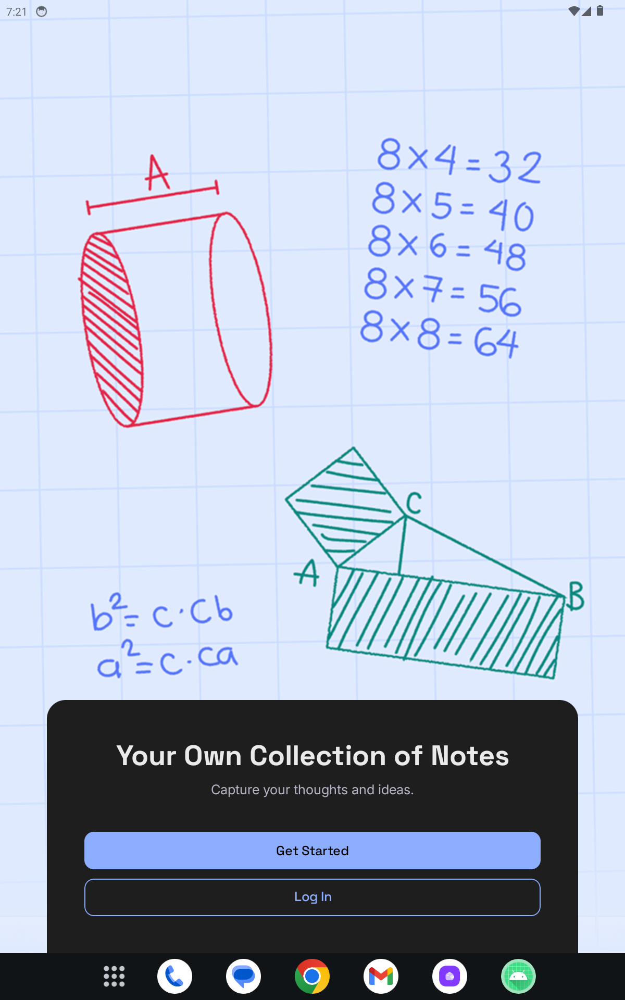

# 📝 NoteMark App

**NoteMark** is an online notes manager app built for the Mobile Dev Campus by [Phillip Lackner](https://pl-coding.com/campus) as part of the monthly challenge. This app is made for fun and to improve skills.

---

## Project Status

This project is divided in 4 different milestones that are launched every fortnight. 
We are currently working in **milestone 1**

### 🚨 Latest Features ###

- **Landing Screen**
  - For the user to choose whether to login or register.
- **Login Screen**
  - Three dots animation
  - Storing tokens and navigating to dashboard when there's a successful login.
- **Register Screen**
  - Manage error handling for username, email and password.
  - Implemented snack bar.

---

## 🧑🏽‍💻 Technical implementation

- ✅ Jetpack Compose.
- ✅ MVI architecture (multi-modularized).
- ✅ Compose Navigator.
- ✅ Koin dependency injection.
- ✅ Kor Client for Network calls.
- ✅ Material Design 3 components and theming.
- ✅ Data Store for user preferences (encrypted with security crypto).

---

## 🎥 Demo ##

https://github.com/user-attachments/assets/bf4d1fc4-500b-4f3a-8d5f-ecdddd0a1709

## 📱 Screenshots ##

### Landing ###

| Mobile Portrait                                                                  | Mobile Landscape                                                                   | 
|----------------------------------------------------------------------------------|------------------------------------------------------------------------------------|
|  |  | 

| Tablet Portrait                                                                  | Tablet Landscape                                                                   |
|----------------------------------------------------------------------------------|------------------------------------------------------------------------------------|
|  |  |

### Register ###

| Mobile Portrait                                                                    | Mobile Landscape                                                                     | 
|------------------------------------------------------------------------------------|--------------------------------------------------------------------------------------|
|  |  | 

| Tablet Portrait                                                                    | Tablet Landscape                                                                     |
|------------------------------------------------------------------------------------|--------------------------------------------------------------------------------------|
|  |  |

### Login ###

| Mobile Portrait                                                              | Mobile Landscape                                                               | 
|------------------------------------------------------------------------------|--------------------------------------------------------------------------------|
|  |  | 

| Tablet Portrait                                                              | Tablet Landscape                                                               |
|------------------------------------------------------------------------------|--------------------------------------------------------------------------------|
|  |  |

---

## 🪪 License

This project is an open-source and free to use. Feel free to fork and upload your commits.

## Acknowledge

- A deep learning about responsive applications. Designed for tablets and phones (landscape or portrait).
- Feeling more comfortable with Koin dependency injection.
- Ktor as network client 
- Data Store for user preferences.

---